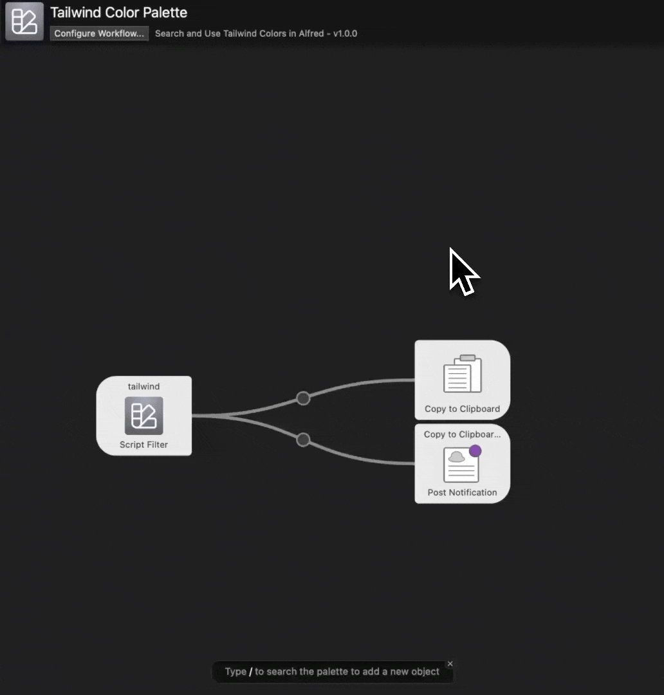

# Tailwind Colors Workflow for Alfred 5

Easily access the Tailwind color selections listed in https://tailwindcss.com/docs/customizing-colors in Alfred.

This workflow was built and tested with Alfred 5, but should also work for past Alfred versions.

## Usage

- Go to the Releases section and download the latest release.
- Open `tailwind-color-palette.alfredworkflow` and Alfred should open to allow you to import the workflow.
- You can use it right away with `tailwind <color-name>` or you can customize the keyword by editing the start node (Script Filter).

## Credits

This workflow was adapted to the Tailwind, along with various minor updates by me, Jeriel del Prado.

This workflow was built from the wonderful Material Colors workflow originally written by Kaito Watanabe - https://github.com/KaitoWatanabe/alfred-material-colors-workflow
